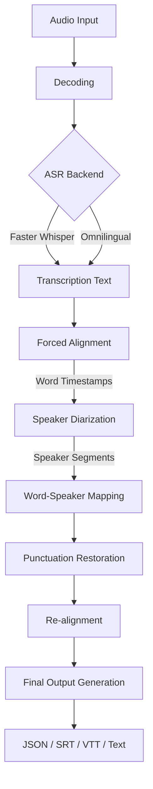

# OISpeech Server

**OISpeech Server** is a comprehensive, production-ready audio processing framework designed to serve state-of-the-art ASR (Automatic Speech Recognition) models with advanced post-processing capabilities. It provides a unified API for transcription, translation, and speaker diarization, supporting multiple pluggable backends.

## 🚀 Features

- **Multi-Backend Architecture**: Seamlessly switch between:
    - **Faster Whisper**: Optimized, high-performance inference for Whisper models.
    - **Omnilingual ASR**: Massive multilingual support using Meta's latest models.
- **Advanced Pipeline**:
    - **Speaker Diarization**: Identifies "who spoke when" using NeMo or Pyannote.
    - **Forced Alignment**: Precise word-level timestamps.
    - **Punctuation Restoration**: Deep multilingual punctuation for readable transcripts.
    - **Intelligent Post-Processing**: Sentence boundary detection, numeral suppression, and speaker realignment.
- **Flexible Deployment**:
    - **GPU accelerated** (CUDA) or **CPU optimized**.
    - **Dockerized** for easy scaling.
    - **OpenAI Compatible API** for seamless integration with existing tools.

## 🛠 Audio Processing Pipeline

The audio goes through a sophisticated multi-stage pipeline to ensure high-quality, readable, and speaker-aware transcripts.



1.  **Decoding**: Audio is normalized to 16kHz mono.
2.  **ASR (Transcription)**: The selected backend generates raw text and initial timestamps.
3.  **Forced Alignment**: A CTC-based aligner refines timestamps to word-level precision.
4.  **Speaker Diarization**: Clustering algorithms identify unique speakers and their time segments.
5.  **Mapping**: Words are assigned to speakers based on timestamp overlap.
6.  **Punctuation**: A deep learning model restores punctuation (periods, commas, etc.).
7.  **Re-alignment**: Sentence boundaries are adjusted based on punctuation for natural reading.

## 📦 Local Development

This project uses [uv](https://docs.astral.sh/uv/) for dependency management.

### Prerequisites

- Python 3.11+
- [uv](https://docs.astral.sh/uv/getting-started/installation/)
- FFmpeg (`brew install ffmpeg` on macOS)

### Installation

**Core dependencies only:**
```bash
uv sync
```

**With Faster Whisper backend:**
```bash
uv sync --extra faster-whisper
```

**With Omnilingual ASR backend:**
```bash
uv sync --extra omnilingual
```

**With all backends:**
```bash
uv sync --all-extras
```

### Running Locally

```bash
uv run uvicorn app.main:app --host 0.0.0.0 --port 8080
```

## 🐳 Building the Image

OISpeech Server supports building a **Unified Image** containing multiple backends, or specialized slim images.

### 1. Unified Build (Recommended)
By default, the image is built with **support for ALL backends** (Faster Whisper + Omnilingual). This allows you to switch backends at runtime without rebuilding.

```bash
# Builds an image with BOTH backends installed
docker compose --profile gpu up --build
```

### 2. Custom/Slim Builds
If you want to reduce image size, you can choose which backends to install using build arguments.

**Faster Whisper Only:**
```bash
export INSTALL_OMNILINGUAL=false
docker compose --profile gpu up --build
```

**Omnilingual Only:**
```bash
export INSTALL_FASTER_WHISPER=false
docker compose --profile gpu up --build
```

### 3. ARM64 GPU Build (CUDA 13)
For ARM64 platforms (e.g. NVIDIA GH200, Jetson AGX), a dedicated Dockerfile uses the [NVIDIA NGC PyTorch](https://catalog.ngc.nvidia.com/orgs/nvidia/containers/pytorch) base image (`26.01-py3`) with CUDA 13.0.2 and PyTorch pre-installed.

```bash
docker compose --profile arm64 up --build
```

## 🏃 Running & Configuration

The system uses a smart startup script to select the backend at runtime.

### Environment Variables

| Variable | Default | Description |
|----------|---------|-------------|
| `ASR_BACKEND` | `faster_whisper` | `faster_whisper` or `omnilingual` |
| `ASR_MODEL` | `medium.en` | Model name (e.g. `large-v3`, `omniASR_CTC_Unlimited_1B_v2`) |
| `ASR_DEVICE` | `auto` | `cuda` (GPU) or `cpu` |
| `ASR_COMPUTE_TYPE` | `float16` | Precision: `float16`, `int8`, `int8_float16` |
| `BATCH_SIZE` | `8` | Batch size for inference |

### Valid Run Commands

**1. Run Faster Whisper (Default)**
```bash
export ASR_BACKEND=faster_whisper
export ASR_MODEL=large-v3
docker compose --profile gpu up
```

**2. Run Omnilingual ASR**
```bash
export ASR_BACKEND=omnilingual
export ASR_MODEL=omniASR_CTC_Unlimited_1B_v2
docker compose --profile gpu up
```

## 📦 Supported Models

### Faster Whisper Backend
Supports all official OpenAI Whisper models and distilled variants.
- **English-only**: `tiny.en`, `base.en`, `small.en`, `medium.en`
- **Multilingual**: `tiny`, `base`, `small`, `medium`, `large-v1`, `large-v2`, `large-v3`, `large-v3-turbo`
- **Distilled**: `distil-large-v2`, `distil-medium.en`, `distil-small.en`, etc.

### Omnilingual ASR Backend
Supports Meta's massive multilingual models (downloads automatically on first use).

**CTC Models** (Faster, recommended for general use):
- `omniASR_CTC_Unlimited_300M_v2` (Lightweight)
- `omniASR_CTC_Unlimited_1B_v2` (Balance of speed/accuracy)
- `omniASR_CTC_Unlimited_3B_v2` (High accuracy)
- `omniASR_CTC_Unlimited_7B_v2` (Maximum accuracy)

**LLM-based Models** (Context-aware, slower, higher VRAM usage):
- `omniASR_LLM_Unlimited_300M_v2`
- `omniASR_LLM_Unlimited_1B_v2`
- `omniASR_LLM_Unlimited_3B_v2`
- `omniASR_LLM_Unlimited_7B_v2`

*Note: The system will auto-download the model on first run.*

**3. Automatic Selection**
If `ASR_BACKEND` is not set, the system guesses based on the model name.
```bash
export ASR_MODEL=omniASR_LLM_Unlimited_7B_v2
docker compose --profile gpu up
# System detects 'omni' and selects omnilingual backend
```

## 💻 Client Usage

### Python (OpenAI SDK)

You can use the standard OpenAI Python client to interact with OISpeech Server.

**Installation:**
```bash
pip install openai
```

**Basic Transcription (Diarization Enabled by Default):**
```python
from openai import OpenAI

client = OpenAI(
    base_url="http://localhost:8001/v1",
    api_key="cant-be-empty"  # Key is required but not validated
)

audio_file = open("audio.mp3", "rb")
transcript = client.audio.transcriptions.create(
    model="default", 
    file=audio_file,
    response_format="verbose_json"
)

# Access diarization data in segments
for segment in transcript.segments:
    print(f"[{segment['start']:.2f}s -> {segment['end']:.2f}s] Speaker {segment['speaker']}: {segment['text']}")
```

**Disable Diarization:**
To disable diarization (faster), pass `diarize=False` via `extra_body`.

```python
transcript = client.audio.transcriptions.create(
    model="default",
    file=audio_file,
    extra_body={
        "diarize": False
    }
)
```

### API Reference (Curl)

**Transcribe with Diarization:**
```bash
curl -X POST http://localhost:8001/v1/audio/transcriptions \
  -F "file=@/path/to/meeting.mp3" \
  -F "diarize=true" \
  -F "response_format=verbose_json"
```

**Translate to English:**
```bash
curl -X POST http://localhost:8001/v1/audio/translations \
  -F "file=@/path/to/german_audio.mp3" \
  -F "model=medium"
```


## Acknowledgements

This project is inspired by [whisper-diarization](https://github.com/MahmoudAshraf97/whisper-diarization).

---
**OISpeech Server** - *The Universal Language Interface.*
